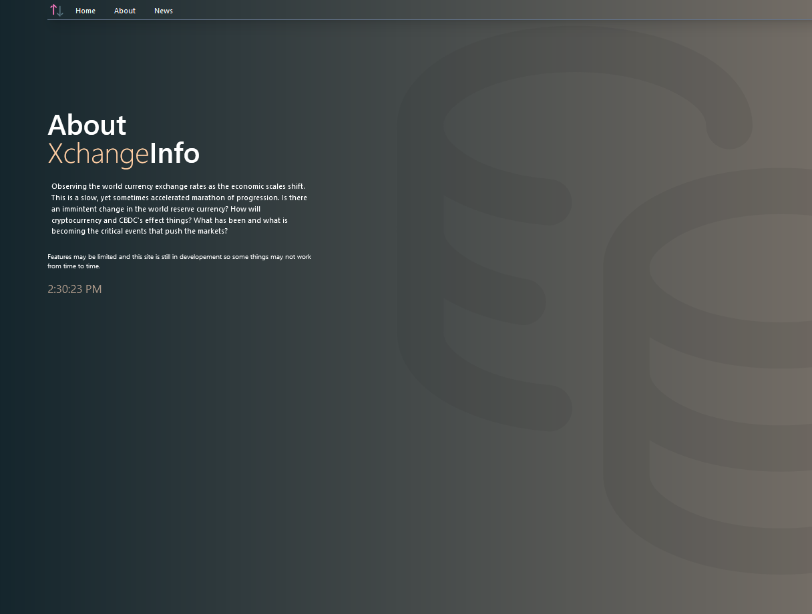
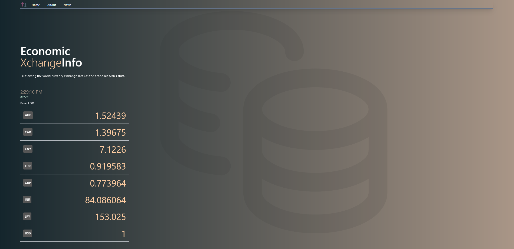
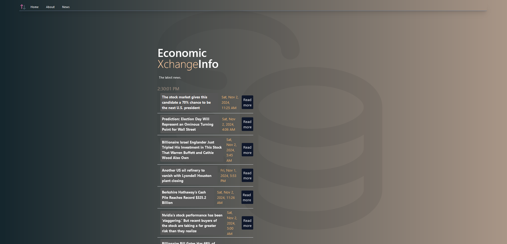

# Simple Currency Exhange Web App

This is a a simple web app that shows the current exhcnage rates compared to the USD. It focuses on USD based news using the Yahoo Finance API. Fun fact, this project was the first project that I used an api with as well as giving tailwindcss a try. I never published it and back then I used a different version of NextJS. We can call this the third version of this app since the first was just using html, css, and javascript.

## Overview
A web application that grabs currency exchange rates comparing them against the US Dollar.

  

  

  

## Features
- Get the latest Currency Exchange Rate of globals currencies compared to the USD.
- Displays US Based Financial News from YahooFinance 

## Technologies Used
- **Frontend**: Next.JS, React, Tailwind CSS, TypeScript
- **Backend**: Node.js, Azure
- **API**: openexchangerates, Yahoo Finance

## Installation
1. Clone the repository:

> git clone <repo-url>

### Install dependencies:

> npm install

### Start the development server:

> npm run dev

# License

This project is licensed under the MIT License. See the [LICENSE](LICENSE) file for details.
